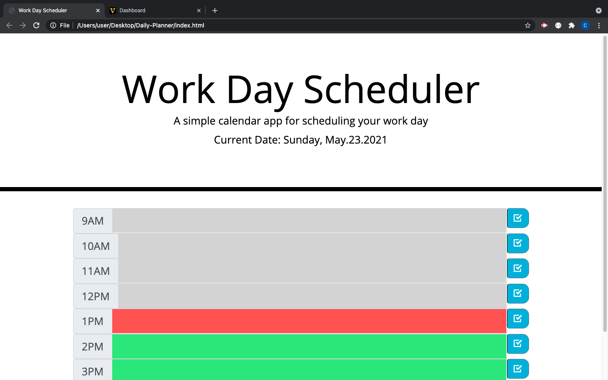

# Daily-Planner

--This is a daily planner that utilizes dayjs to help users keep track of their schedules. 

--The current date is displayed at the top of the Planner.

--The app will update time blocks with color coding according to the hour of the day.
     
     -Gray indicates a time block in the past, Red indicates the present, Green indicates the future. 

--Users can update tasks by typing a task into a text box next to the hour that best suits their needs, and clicking save.

## Website
https://codyconck.github.io/Daily-Planner/

## Screenshot

## Built With
*HTML
*CSS
*JS

## Contribution
Cody Concklin

